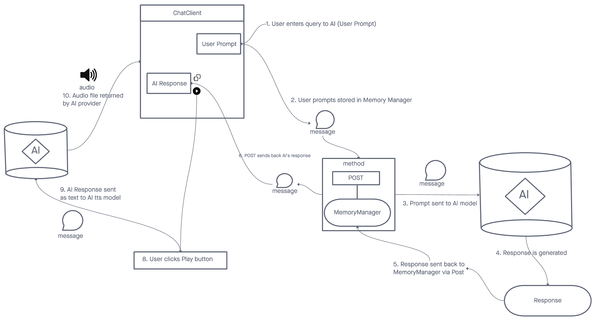

# Chat Craft v1.0

## Problem Domain
Multiple AI Chatbots, each with their own personality, that you can converse with. 
The rationale of this project includes:
- Getting hands on experience and a deeper understanding of implementing changes to a complex codebase
- Enhance knowledge of coding principles at scale
- Deepen our knowledge of a contemporary tech stack

## Deployed App
The app can be used here: [chat-craft.vercel.app](https://chat-craft.vercel.app)

If you're wanting to upgrade to Pro, use the following Credit Card details:

## UML

## Tech stack
- Tailwind CSS
  - Tailwind CSS is a highly customizable, low-level CSS framework that gives you all of the building blocks you need to build bespoke designs without any annoying opinionated styles you have to fight to override. It's designed to be a utility-first CSS where classes are added in the HTML rather than in separate CSS selectors. This means that you can build a whole webpage without writing a single line of CSS.
- Shadcn
  - Shadcn is a lightweight, flexible, and efficient shadow DOM library for building web components. It provides a simple and intuitive API for creating and managing shadow DOM trees, making it easier to build encapsulated, reusable components.
- NextJS
  - Next.js is an open-source development framework built on top of Node.js enabling React based web applications functionalities such as server-side rendering and generating static websites.
- Clerk 
  - Clerk is a complete user management and authentication service that helps you create secure and delightful experiences for your users. It provides features like sign up, sign in, two-factor authentication, password reset, and more. It's designed to be developer-friendly with a simple API, making it easy to integrate with your tech stack.
- PlanetScale
  - PlanetScale is a reliable and scalable relational database platform and clustering system for horizontal scaling of MySQL. It allows you to deploy, run, and manage databases with high availability, security, and performance needs. It also provides a SQL interface for data access, making it a great choice for applications that need the power and flexibility of a relational database.

## Notes

### Prisma DB
- every time the Prisma schema is updated (/prisma/schema.prisma), you must run these two commands:
- `npx prisma generate`
- `npx prisma db push`
- this regenerates the schema and then pushes it to PlanetScale
- it's always best to restart the server once this has happened
- to run the prisma viewer: `npx prisma studio`

### Code versioning
- Deprecated code was found using this tutorial
  - to get around it I installed an older version of pinecone and its dependence langchain:
  - `npm install @pinecone-database/pinecone@0.1.6`
  - `npm install langchain@0.0.92`
  - instead of pinecone 1.2 and langchain 0.186

### Stripe

- when working to test stripe payments, make sure that this is running:
  - `stripe listen --forward-to localhost:4242/webhook`
